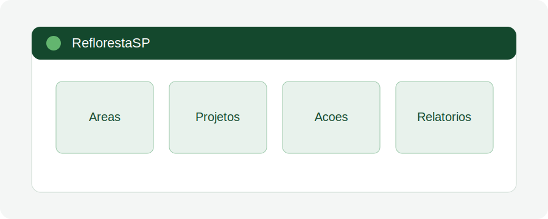

# Aula 01 - Visão geral da plataforma

## Objetivo da aula

Apresentar a finalidade da ReflorestaSP, seus principais módulos e o papel da plataforma no acompanhamento das iniciativas de restauração.

## Explicação principal

A ReflorestaSP organiza informações relacionadas a áreas, projetos, ações de restauração, evidências e relatórios. Para o uso interno da SEMIL, a plataforma deve ser entendida como um ambiente de consulta, registro e acompanhamento, com foco em padronização de dados e rastreabilidade das informações.

## Passo a passo

1. Acesse a plataforma ReflorestaSP pelo endereço oficial definido pela equipe.
2. Observe os principais menus disponíveis.
3. Identifique onde ficam os módulos de áreas, projetos, ações e relatórios.
4. Verifique quais informações são apenas consultadas e quais podem ser editadas pelo seu perfil.
5. Anote dúvidas sobre termos, campos ou fluxos que precisem de alinhamento interno.

## Vídeo da aula

<video controls width="100%">
  <source src="videos/aula-01.mp4" type="video/mp4">
  Seu navegador não suporta vídeo HTML5.
</video>

## Material complementar

- [Baixar PDF da Aula 01](pdfs/material-complementar-aula-01.pdf)
- [Acessar slides da Aula 01](slides/aula-01.pdf)

## Resumo final

Nesta aula, você conheceu a lógica geral da ReflorestaSP e a importância de usar a plataforma como fonte estruturada de registro e acompanhamento das informações de restauração.
