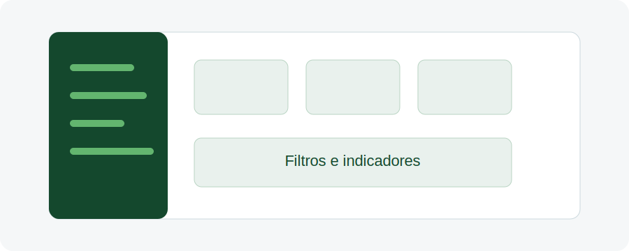

# Aula 03 - Governança e Estrutura da Plataforma

## Objetivo da aula

Apresentar as instituições envolvidas, a estrutura de governança da plataforma e o papel do banco de dados.

**Duração estimada:** cerca de 10 minutos.

## Explicação principal

A Refloresta-SP é resultado de uma articulação institucional e técnica que envolve SEMIL, FIA, especialistas e universidades. Essa colaboração permite reunir diferentes competências para construir e manter uma plataforma baseada em evidências.

A estrutura de governança inclui gestão geral, gestão científica, infraestrutura e comitê técnico-científico. O banco de dados tem papel central, pois organiza as informações que sustentam as recomendações, simulações e resultados apresentados pela plataforma.

## Passo a passo

1. Identifique as instituições envolvidas na iniciativa.
2. Entenda a função da gestão geral.
3. Entenda a função da gestão científica.
4. Reconheça a importância da infraestrutura tecnológica.
5. Observe o papel do comitê técnico-científico.
6. Relacione a governança ao uso qualificado do banco de dados.

## Vídeo da aula

<video controls width="100%">
  <source src="videos/aula-03.mp4" type="video/mp4">
  Seu navegador não suporta vídeo HTML5.
</video>

## Material complementar

- [Baixar PDF da Aula 03](pdfs/material-complementar-aula-03.pdf)
- [Acessar slides da Aula 03](slides/aula-03.pdf)

## Resumo final

Mensagem-chave: a plataforma é baseada em governança técnica robusta e colaboração científica.
