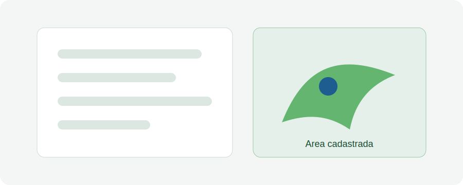

# Aula 04 - Cadastro de áreas

## Objetivo da aula

Orientar o cadastro e a conferência de áreas na plataforma, com atenção aos campos obrigatórios e à qualidade das informações.

## Explicação principal

O cadastro de áreas é uma etapa central para organizar as iniciativas de restauração. Informações como identificação, localização, vínculo territorial e dados básicos da área devem ser preenchidas com consistência, pois serão usadas em consultas, monitoramentos e relatórios.

## Passo a passo

1. Acesse o módulo de áreas.
2. Clique na opção de novo cadastro, quando seu perfil permitir.
3. Preencha os campos de identificação da área.
4. Informe localização, município, referência territorial e demais dados obrigatórios.
5. Revise os dados antes de salvar.
6. Salve o cadastro e confirme se a área aparece na listagem.
7. Registre eventuais pendências de informação para complementação posterior.

## Vídeo da aula

<video controls width="100%">
  <source src="videos/aula-04.mp4" type="video/mp4">
  Seu navegador não suporta vídeo HTML5.
</video>

## Material complementar

- [Baixar PDF da Aula 04](pdfs/material-complementar-aula-04.pdf)
- [Acessar slides da Aula 04](slides/aula-04.pdf)

## Resumo final

O cadastro de áreas deve ser feito com atenção aos campos obrigatórios, à padronização dos nomes e à conferência dos dados territoriais antes do salvamento.
