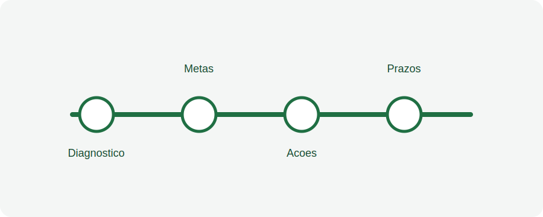

# Aula 06 - Planejamento de restauração

## Objetivo da aula

Apresentar o fluxo de planejamento de restauração e os principais cuidados ao registrar metas, etapas e estratégias.

## Explicação principal

O planejamento de restauração organiza as ações previstas para uma área ou projeto. Ele deve refletir decisões técnicas, prazos, responsáveis, métodos adotados e critérios de acompanhamento.

## Passo a passo

1. Abra o módulo relacionado a projetos ou planejamento.
2. Selecione a área ou projeto que receberá o planejamento.
3. Informe objetivos, metas e estratégia de restauração.
4. Registre etapas previstas, prazos e responsáveis.
5. Anexe ou referencie documentos técnicos, quando necessário.
6. Revise a coerência das informações antes de salvar.
7. Confirme se o planejamento ficou associado à área correta.

## Vídeo da aula

<video controls width="100%">
  <source src="videos/aula-06.mp4" type="video/mp4">
  Seu navegador não suporta vídeo HTML5.
</video>

## Material complementar

- [Baixar PDF da Aula 06](pdfs/material-complementar-aula-06.pdf)
- [Acessar slides da Aula 06](slides/aula-06.pdf)

## Resumo final

O planejamento deve traduzir a estratégia de restauração em registros claros, com metas, etapas, responsáveis e informações suficientes para acompanhamento posterior.
