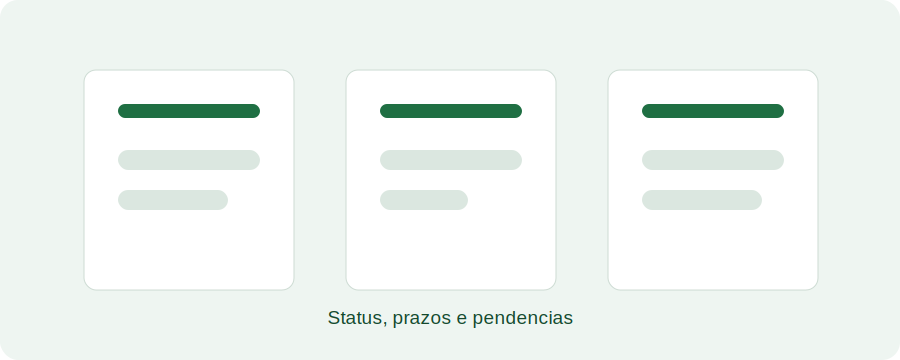

# Aula 08 - Acompanhamento de projetos

## Objetivo da aula

Mostrar como acompanhar projetos, verificar andamento, consultar registros e identificar pendências.

## Explicação principal

O acompanhamento de projetos depende da atualização contínua das informações. Consultar status, prazos, ações registradas e pendências permite que as equipes tomem decisões com base em dados atualizados.

## Passo a passo

1. Acesse o módulo de projetos.
2. Use filtros para localizar o projeto desejado.
3. Abra o detalhe do projeto.
4. Verifique status, prazos, áreas associadas e ações registradas.
5. Identifique pendências ou informações incompletas.
6. Atualize registros permitidos pelo seu perfil.
7. Anote demandas que dependam de outra equipe ou validação técnica.

## Vídeo da aula

<video controls width="100%">
  <source src="videos/aula-08.mp4" type="video/mp4">
  Seu navegador não suporta vídeo HTML5.
</video>

## Material complementar

- [Baixar PDF da Aula 08](pdfs/material-complementar-aula-08.pdf)
- [Acessar slides da Aula 08](slides/aula-08.pdf)

## Resumo final

O acompanhamento de projetos combina consulta, atualização responsável e registro de pendências para manter a gestão interna alinhada.
