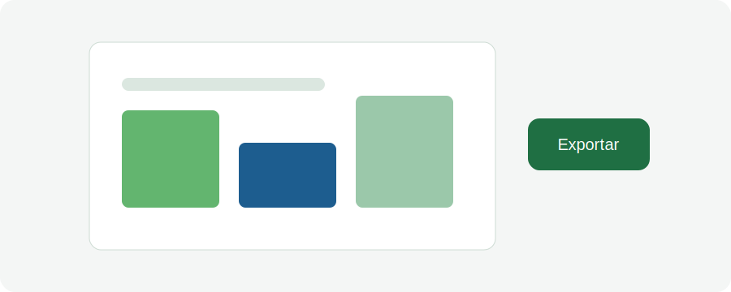

# Aula 09 - Funcionamento da Plataforma

## Objetivo da aula

Explicar o funcionamento da plataforma pela visão do usuário, destacando como a complexidade técnica é simplificada.

**Duração estimada:** cerca de 10 minutos.

## Explicação principal

Para o usuário, o processo deve ser simples: informar preferências, acionar filtros automáticos e receber modelos pré-calculados ou recomendações compatíveis com o objetivo do plantio. Nos bastidores, a plataforma processa dados, critérios e simulações complexas.

Essa separação entre simplicidade de uso e robustez técnica é fundamental. O usuário interage com uma ferramenta objetiva, enquanto a plataforma incorpora uma estrutura científica e computacional mais sofisticada.

## Passo a passo

1. Observe quais preferências o usuário informa.
2. Entenda como os filtros automáticos reduzem alternativas.
3. Identifique o papel dos modelos pré-calculados.
4. Reconheça a complexidade técnica que fica nos bastidores.
5. Analise como a interface facilita a tomada de decisão.
6. Relacione simplicidade de uso com qualidade das recomendações.

## Vídeo da aula

<video controls width="100%">
  <source src="videos/aula-09.mp4" type="video/mp4">
  Seu navegador não suporta vídeo HTML5.
</video>

## Material complementar

- [Baixar PDF da Aula 09](pdfs/material-complementar-aula-09.pdf)
- [Acessar slides da Aula 09](slides/aula-09.pdf)

## Resumo final

Mensagem-chave: a tecnologia transforma um sistema complexo em uma ferramenta simples para o usuário.
