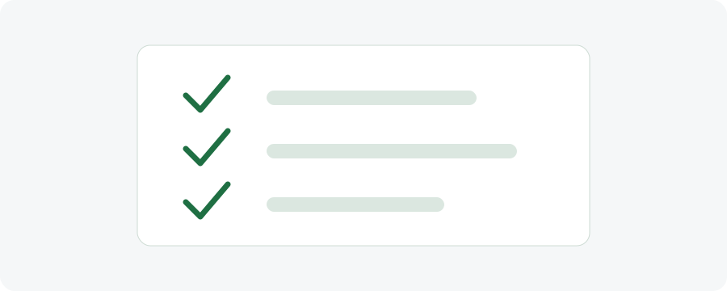

# Aula 10 - Boas práticas de uso interno

## Objetivo da aula

Consolidar boas práticas para uso interno da plataforma, com foco em padronização, segurança da informação e qualidade dos registros.

## Explicação principal

O uso consistente da ReflorestaSP depende de padrões comuns entre as equipes. Nomes, descrições, anexos, datas, comentários e atualizações devem seguir critérios claros para evitar duplicidade, ambiguidade e perda de rastreabilidade.

## Passo a passo

1. Use nomes claros e padronizados em cadastros e registros.
2. Evite duplicar áreas, projetos ou ações.
3. Revise dados antes de salvar alterações.
4. Anexe arquivos com nomes compreensíveis.
5. Registre observações objetivas e relevantes.
6. Respeite as permissões do seu perfil.
7. Comunique inconsistências pelo canal interno definido.

## Vídeo da aula

<video controls width="100%">
  <source src="videos/aula-10.mp4" type="video/mp4">
  Seu navegador não suporta vídeo HTML5.
</video>

## Material complementar

- [Baixar PDF da Aula 10](pdfs/material-complementar-aula-10.pdf)
- [Acessar slides da Aula 10](slides/aula-10.pdf)

## Resumo final

Boas práticas reduzem retrabalho, aumentam a confiabilidade dos dados e facilitam a continuidade das atividades entre equipes.
