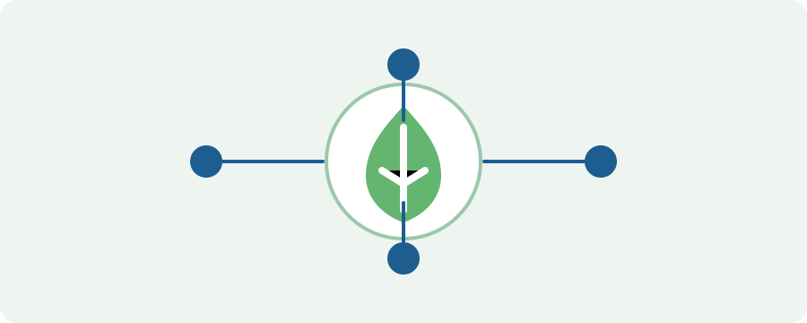

# Aula 11 - Encerramento e próximos passos

## Objetivo da aula

Revisar os principais aprendizados do treinamento e orientar os próximos passos para uso contínuo da ReflorestaSP.

## Explicação principal

Ao final do treinamento, espera-se que os participantes conheçam a estrutura da plataforma, saibam acessar os módulos principais, registrar informações essenciais, consultar dados, acompanhar projetos e gerar relatórios conforme as necessidades internas.

## Passo a passo

1. Revise os principais pontos de cada aula.
2. Identifique quais fluxos são mais frequentes na sua rotina.
3. Consulte os materiais complementares quando tiver dúvida.
4. Pratique os registros em ambiente adequado, se houver ambiente de treinamento.
5. Reúna dúvidas recorrentes para atualização futura deste material.
6. Siga os canais internos para suporte, correções de acesso e melhoria dos fluxos.

## Vídeo da aula

<video controls width="100%">
  <source src="videos/aula-11.mp4" type="video/mp4">
  Seu navegador não suporta vídeo HTML5.
</video>

## Material complementar

- [Baixar PDF da Aula 11](pdfs/material-complementar-aula-11.pdf)
- [Acessar slides da Aula 11](slides/aula-11.pdf)

## Resumo final

O treinamento apresentou a base necessária para uso interno da ReflorestaSP. A evolução do material deve acompanhar mudanças na plataforma e nos procedimentos da SEMIL.
